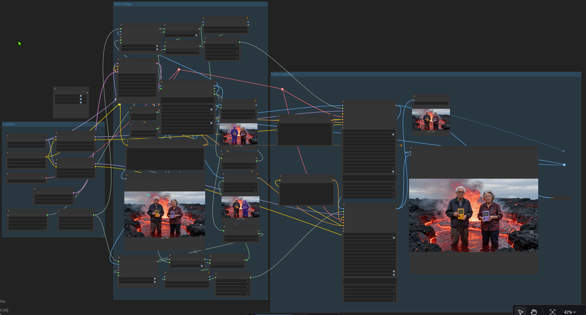

# Dual Character LoRA Inpaint T2I Workflow by RogboArt

### Dependencies
This workflow uses nodes from:
- [rgthree-comfy](https://github.com/rgthree/rgthree-comfy)
- [kjnodes](https://github.com/kijai/ComfyUI-KJNodes)
- [Florence2](https://github.com/kijai/ComfyUI-Florence2)
- [segment-anything-2](https://github.com/kijai/ComfyUI-segment-anything-2)
- [impact-pack](https://github.com/ltdrdata/ComfyUI-Impact-Pack)

### Usage
1.  This workflow features a switcher to disable Detailing until you have your image setup as you wish. Leave "LoRA Detailers" off until you are ready.  

2. Get your prompt ready
3. Configure your Segment Selection (Observe Left and Right flows)

4. When ready, click the dark dot next to LoRA Detailers to turn it on and hit generate.
5. Celebrate!

- Florence2 can highlight a whole bunch of stuff, person works best for what we're doing but if you want more specifics, try whatever you want.
- The person indexes are 0-based and should match what you see in the preview after person detection
- Mostly you will be modifying:
    - The main prompt, seed, etc for generating the main image
    - The Left and Right prompts for the detailers, seed, etc as well
    - Indexes, sometimes florence+sam seems to swap the people so that's why we keep the seed fixed and we watch outputs.

### Note
#### This can be expanded to include more LoRAs if you want! 
- This workflow does not include my personal LoRAs and they're not accessible.  You have to find your own character LoRAs, there are plenty around.
- You will likely have to adjust settings depending on your image.  This just gets you to the point where you can do that!
- I'M SORRY FOR THE WIRE MESS! Wiring in comfy is not my specialty.  It works and it functions and you can mostly ignore the wires.  If someone wants to clean it up though, I'd happily review a PR!

### Zoomed out workflow
