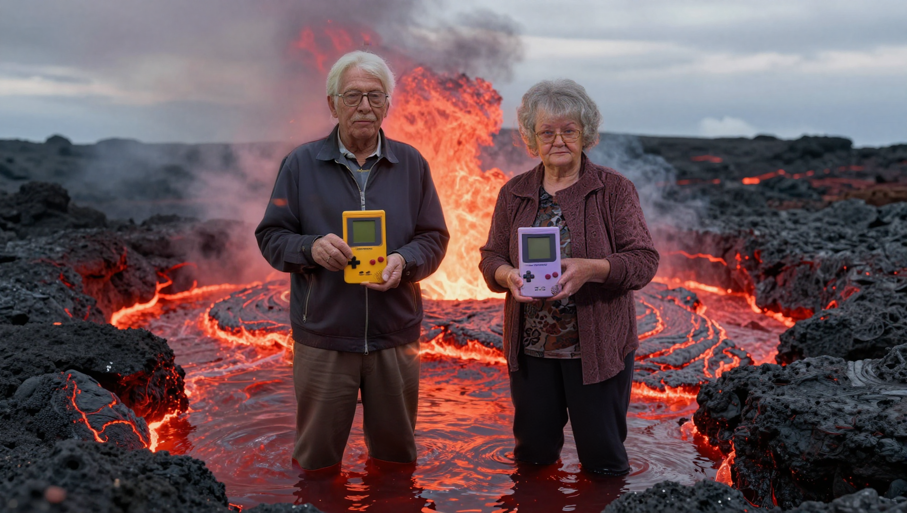
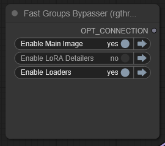
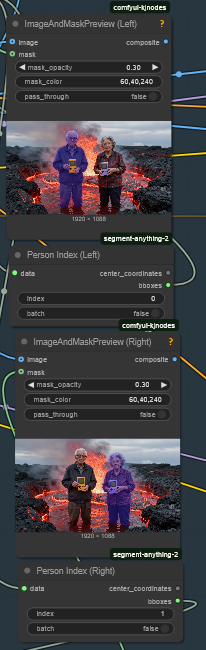

# Dual Character LoRA Inpaint T2I Workflow by RogboArt

### Dependencies
This workflow uses nodes from:
- [rgthree-comfy](https://github.com/rgthree/rgthree-comfy)
- [kjnodes](https://github.com/kijai/ComfyUI-KJNodes)
- [Florence2](https://github.com/kijai/ComfyUI-Florence2)
- [segment-anything-2](https://github.com/kijai/ComfyUI-segment-anything-2)
- [impact-pack](https://github.com/ltdrdata/ComfyUI-Impact-Pack)

### Usage
1.  This workflow features a switcher to disable Detailing until you have your image setup as you wish. Leave "LoRA Detailers" off until you are ready.  

2. Get your prompt ready
3. Configure your Segment Selection (Observe Left and Right flows)

4. When ready, click the dark dot next to LoRA Detailers to turn it on and hit generate.
5. Celebrate!

### Note
- This workflow does not include my personal LoRAs and they're not accessible.  You have to find your own character LoRAs, there are plenty around.
- You will likely have to adjust settings depending on your image.  This just gets you to the point where you can do that!

